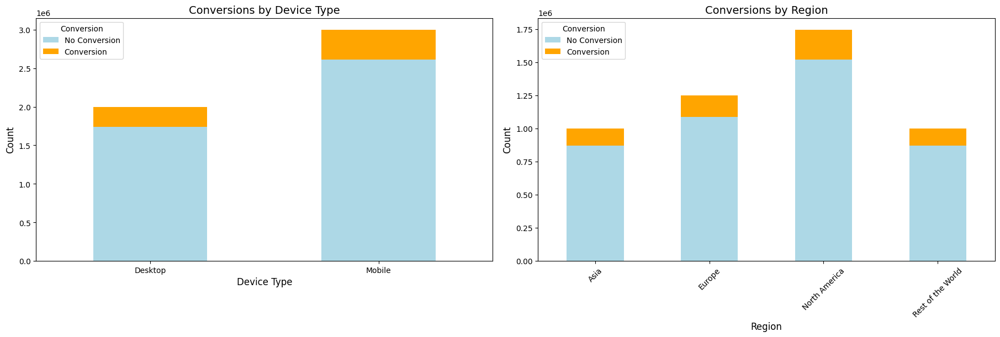
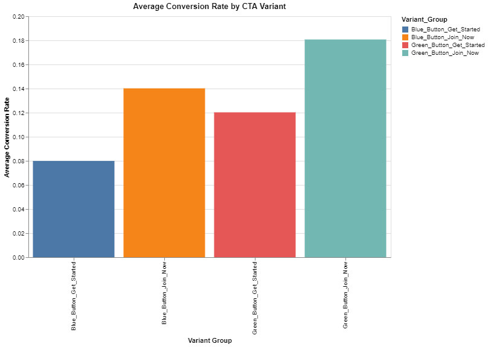
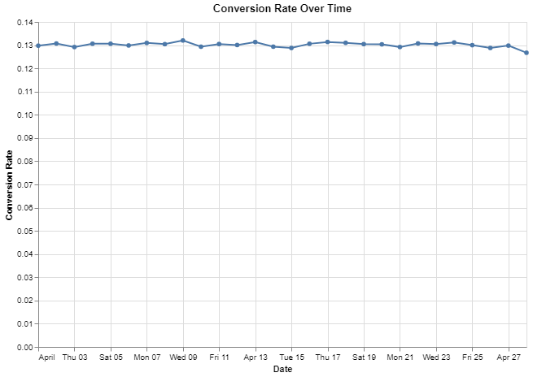
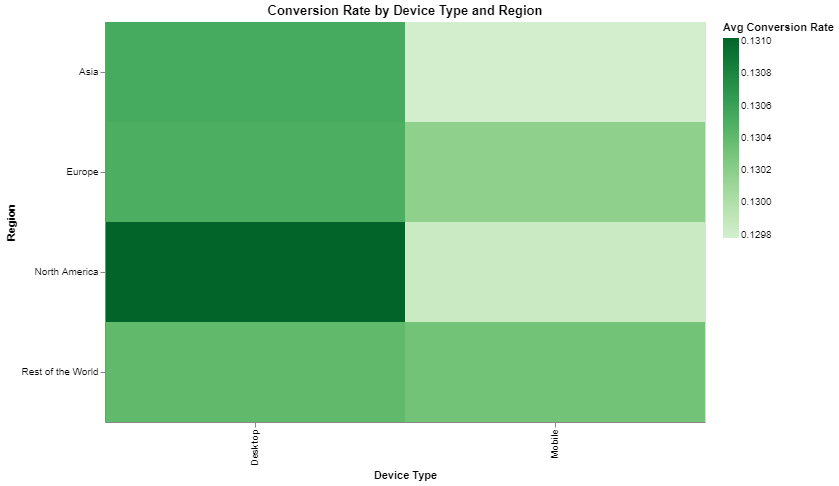
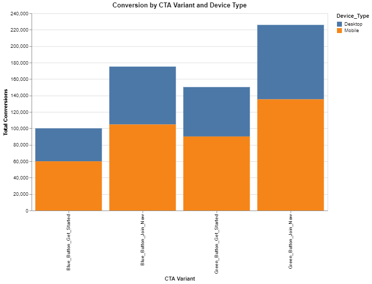
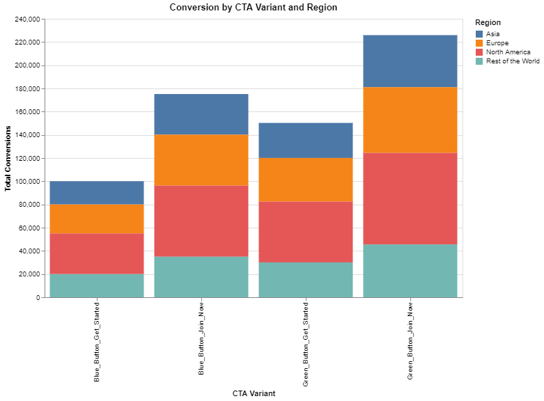

# 🔬 Optimizing Website Conversion Rate with CTA Button Design 

          

An end-to-end A/B testing project to` optimize website conversions` by testing different `CTA button` designs. The project involves `data collection`, `random user assignment`, `statistical analysis` using `Chi-Square` and `Z-tests`, and visualizations to identify the most effective `CTA` combination for maximizing conversions.

----
## 🎯 Motive (Problem Statement)

A digital marketing agency wants to improve the `conversion rate` (number of users who complete a desired action like `signing up`, `purchasing`, or `clicking a button`) on a client’s landing page. The client believes that changing the color and wording of the `Call-To-Action` `(CTA)` button might influence user behavior.

## ❓ Key Questions to Answer

**1.** Does changing the `CTA button` color (e.g., `Green` vs. `Blue`) impact the conversion rate significantly?

**2.** Does modifying the `CTA` text (e.g., "`Get Started`" vs. "`Join Now`") affect user engagement and conversions?

**3.** Is there an interaction effect between `CTA button` color and `text` on the conversion rate?

**4.** Which `CTA` variant `(color + text)` results in the highest `conversion rate`?

**5.** How do device type `(Mobile vs. Desktop)`, `region`, and `age group` affect the success of different `CTA` variants?

**6.** What is the optimal combination of `CTA color` and `text` for maximizing conversions?

## 🧪 Methodology

- **Data Collection:**
    - Gathered user interaction data from the `landing page`, including `CTA button variants`, `device type`, `region`, and `conversion status`.
    - Captured additional metrics such as `engagement time`, `session duration`, and `click-through rate` `(CTR)`.

- **Preprocessing:**
    - Removed `duplicates` and `handled missing values`.
    - Converted data types for `categorical` and `datetime` fields.
    - Encoded `categorical variables` into `numerical` representations for analysis.

- **Exploratory Data Analysis (EDA):**
    - Analyzed conversion rates across `CTA variants`, `device types`, and `regions`.
    - Visualized `trends` using `bar charts`, `heatmaps`, and `line charts`.
    - Explored `engagement patterns` and `user activity levels`.

- **Sample Size and Power Analysis:**
    - Calculated the `minimum sample size` required to detect meaningful differences in `conversion rates` with `80%` power and a `5%` significance level.

- **Statistical Testing:**
    - **Chi-Square Test:** `Assessed the relationship between CTA variants and conversion rates.`
    - **Z-Test for Two Proportions:** `Compared conversion rates between two specific CTA variants.`
    - **ANOVA:** `Evaluated differences in conversion rates across all CTA variants.`
    - **Logistic Regression:** `Identified significant predictors of conversion, including CTA design, device type, and region.`

- **Result Interpretation:**
    - Determined the most effective `CTA variant` based on `statistical significance` and `effect size`.
    - Assessed the impact of `device type` and `regional differences` on `conversion rates`.

- **Visualization:**
    - Presented insights using `stacked bar charts`, `heatmaps`, and `line charts`.
    - Highlighted `key trends` and patterns in `user behavior` and `engagement`.


- **Recommendations:**
    - Provided actionable insights for `optimizing CTA design`, `mobile experience`, and `regional targeting`.

## 🧰 Technologies & Libraries Used

- **Language:** `Python`

- **Core Libraries:** `pandas`, `numpy`, `scipy`, `statsmodels`

- **Visualization:** `matplotlib`, `seaborn`, `altair`

- **Statistical Analysis:** `statsmodels`, `scipy`

- **Data Manipulation:** `pandas`, `numpy`

- **Environment:** `Jupyter Notebook`

- **Data Format:** `CSV/Excel`

----

## 📝 Data Collection
### 📑 Data Summary
- **Total Rows:** `5000000`
- **Total Columns:** `12`
### 📊 Categorical Variables
🔸 **User_ID**

- **Type:** `Categorical` (UUID String)

- **Description:** `Unique identifier for each user`.

🔸 **Variant_Group**

- **Type:** `Categorical`

- **Description:** `CTA button variant shown to the user`.

- **Unique Values:**

    - `Green_Button_Get_Started`

    - `Blue_Button_Get_Started`

    - `Green_Button_Join_Now`

    - `Blue_Button_Join_Now`

🔸 **Converted**

- **Type:** `Numeric` (Binary)

- **Description:** 

    - Indicates whether the user converted `(1)` or not `(0)`.
    - **Value 1:** `The user completed the desired action (e.g., clicked CTA, signed up, made a purchase)`.
    - **Value 0:** `The user did not complete the desired action`.

🔸 **Device_Type**

- **Type:** `Categorical`

- **Description:** `Device used by the user`.

- **Unique Values:** 
    - `Mobile` 

    - `Desktop`

🔸 **Region**

- **Type:** `Categorical`

- **Description:** `User's geographic region`.

- **Unique Values:**

    - `North America`

    - `Europe`

    - `Asia`

    - `Rest of the World`

🔸 **Engagement_Time_Seconds**

- **Type:** `Numeric`

- **Description:** `Time (in seconds) that the user engaged with the landing page`.

🔸 **Session_Duration_Seconds**

- **Type:** `Numeric`

- **Description:** `Total session time (in seconds) recorded for the user session`.

🔸 **CTR (Click-Through Rate)**

- **Type:** `Numeric`

- **Description:** `Ratio of users who clicked compared to those who visited the page`.

🔸 **Group_ID**

- **Type:** `Numeric`

- **Description:** `Experiment group identifier for segmented testing`.

🔸 **Visit_Date**

- **Type:** `Date`

- **Description:** `The date when the user visited the page`.

🔸 **Visit_Time**

- **Type:** `Time` (String)

- **Description:** `The time of the day the user visited`.

🔸 **Activity_Level**

- **Type:** `Numeric`

- **Description:** `Activity Level (scaled from 0 to 20)`.

🔸 **Range:** `April 1, 2025` – `April 28, 2025`

### 📋 Sample Data
| `User_ID`                              | `Variant_Group`         | `Converted` | `Device_Type` | `Region`      | `Engagement_Time_Seconds` | `Session_Duration_Seconds` | `CTR`     | `Group_ID` | `Visit_Date` | `Visit_Time` | `Activity_Level` |
|------------------------------------------|---------------------------|---------------|-----------------|-----------------|-----------------------------|------------------------------|-------------|--------------|----------------|----------------|--------------------|
| `1b69b842-5525-41c3-85b9-9f14edfee03e`     | `Blue_Button_Get_Started`   | `0`             | `Desktop`         | `North America`   | `40.341746`                  | `137.043115`                  | `33.194960`   | `1`            | `2025-04-14`     | `21:00:00`      | `1`                  |
| `d6bcaf5b-97dd-4579-b7a2-5d553a970698`     | `Blue_Button_Join_Now`      | `0`             | `Mobile`          | `Asia`            | `26.800653`                  | `251.597974`                  | `33.641204`   | `0`            | `2025-04-11`     | `20:00:00`      | `5`                  |
| `570e4f1a-444c-44cf-a496-71060071f46b`     | `Green_Button_Join_Now`     | `0`             | `Desktop`         | `Asia`            | `26.641052`                  | `157.241931`                  | `32.540892`   | `1`            | `2025-04-08`     | `18:00:00`      | `0`                  |
| `7fc3df90-1400-42bc-8e94-f9e0dcc7ea08`     | `Green_Button_Join_Now`     | `0`             | `Desktop`         | `Europe`          | `65.900691`                  | `305.558975`                  | `35.720069`   | `0`            | `2025-04-20`     | `21:00:00`      | `10`                 |
| `4b4c4ff0-7ff4-4b0b-959b-71d3ee9c951f`     | `Green_Button_Get_Started`  | `0`             | `Mobile`          | `North America`   | `42.666789`                  | `186.434137`                  | `34.378063`   | `1`            | `2025-04-02`     | `10:00:00`      | `1`                  |


## Preprocessing
### Checking Missing Values

| `Columns`                    | `Missing Values` | `Percentage` |
|-----------------------------|------------------|--------------|
| `User_ID`                   | `0`              | `0.00%`      |
| `Variant_Group`             | `0`              | `0.00%`      |
| `Converted`                 | `0`              | `0.00%`      |
| `Device_Type`               | `0`              | `0.00%`      |
| `Region`                    | `0`              | `0.00%`      |
| `Engagement_Time_Seconds`   | `0`              | `0.00%`      |
| `Session_Duration_Seconds`  | `0`              | `0.00%`      |
| `CTR`                       | `0`              | `0.00%`      |
| `Group_ID`                  | `0`              | `0.00%`      |
| `Visit_Date`                | `0`              | `0.00%`      |
| `Visit_Time`                | `0`              | `0.00%`      |
| `Activity_Level`            | `0`              | `0.00%`      |


### Before and After Data Type Comparison

| `Columns Name`             | `Before`             | `After`              |
|------------------------------|--------------------------|-------------------------|
| `User_ID`                    | `object`                 | `object`                |
| `Variant_Group`              | `object`                 | `category`              |
| `Converted`                  | `int64`                  | `int64`                 |
| `Device_Type`                | `object`                 | `category`              |
| `Region`                     | `object`                 | `category`              |
| `Engagement_Time_Seconds`    | `float64`                | `float64`               |
| `Session_Duration_Seconds`   | `float64`                | `float64`               |
| `CTR`                        | `float64`                | `float64`               |
| `Group_ID`                   | `int64`                  | `int64`                 |
| `Visit_Date`                 | `object`                 | `datetime64[ns]`        |
| `Visit_Time`                 | `object`                 | `time`                  |
| `Activity_Level`             | `int64`                  | `int64`                 |


## Exploratory data analysis (EDA)
### Conversion of Device Type and Region

### Average Conversion Rate by CTA Variant

### Conversion Rate Over Time

### Conversion Rate Distribution by Device Type and Region

### Conversion by CTA Variant and Device Type

### Group by CTA Variant and Region


## Sample Size and Power Calculation
`Sample size of 3532 users per group ensures an 80% chance of detecting a 2% difference in conversion rates with a 5% significance level, providing reliable results and minimizing the risk of false positives.`

## Statistical Testing of A/B Testing
### 📊 Chi-Square Test (CTA Variant vs Conversion)
**Assumptions for Chi-Square Test**

- **Independence**: Observations are independent of one another.
- **Sample Size**: Sufficiently `large sample size` per group `(n > 30)` for `normal approximation`.
- **Mutually Exclusive**: Categories are `mutually exclusive` and `collectively exhaustive`.


**Purpose:**
- The Chi-Square Test is used to assess whether there is a `significant relationship` between `CTA variant` (`Variant_Group`) and `conversion status` (`Converted`).

**Hypotheses:**
- **Null Hypothesis (H₀):** `There is no relationship between CTA Variant and Conversion.`

- **Alternative Hypothesis (H₁):** `There is a relationship between CTA Variant and Conversion.`

`Chi-Square Statistic: 58239.08694630726`
`P-Value: 0.0`
`Degrees of Freedom: 3`
`Conclusion: Significant relationship between CTA Variant and Conversion (Reject Null Hypothesis).`

### 📊 Z-Test for Two Proportions (Compare Two CTA Variants)

**Assumptions for Z-Test**

- **Independence**: Observations are `independent of one another`.
- **Sample Size**: Sufficiently `large sample size` per group `(n > 30)` for `normal approximation`.


**Purpose:**
To compare the conversion rates between two specific `CTA variants`. For example, `comparing Green_Button_Get_Started` and `Blue_Button_Get_Started`.

**Hypotheses:**

- **Null Hypothesis (H₀):** `There is no significant difference between the conversion rates of the two CTA variants.`

- **Alternative Hypothesis (H₁):** `There is a significant difference between the conversion rates of the two CTA variants.`

`Z-Statistic: 106.21196931980978`
`P-Value: 0.0`
`Conclusion: Significant difference between the two CTA variants (Reject Null Hypothesis).`

###  📊 ANOVA (Across All CTA Variants)
**Assumptions for ANOVA**

- **Independence**: Observations are `independent of one another`.
- **Sample Size**: Sufficiently `large sample size` per group `(n > 30)` for normal approximation.
- **Homogeneity of Variance**: The variance among groups is assumed to be roughly equal.

**Purpose:**
The ANOVA test is used to determine if there is a significant difference in conversion rates across multiple `CTA variants`. We want to test if the conversion rates differ for `Green_Button_Get_Started`, `Blue_Button_Get_Started`, `Green_Button_Join_Now`, and `Blue_Button_Join_Now`.

**Hypotheses:**

- **Null Hypothesis (H₀):** `All CTA variants have the same conversion rates.`

- **Alternative Hypothesis (H₁):** `At least one CTA variant has a different conversion rate.`

`F-Statistic: 19641.797522417222`
`P-Value: 0.0`
`Conclusion: Significant difference in conversion rates across CTA variants (Reject Null Hypothesis).`

### Logistic Regression Analysis
```markdown
                    Optimization terminated successfully.
                      Current function value: 0.420211
                                Iterations 6
                           Logit Regression Results                           
==============================================================================
Dep. Variable:              Converted   No. Observations:              5000000
Model:                          Logit   Df Residuals:                  4999993
Method:                           MLE   Df Model:                            6
Date:                Sun, 27 Apr 2025   Pseudo R-squ.:                -0.08610
Time:                        17:12:42   Log-Likelihood:            -2.1011e+06
converged:                       True   LL-Null:                   -1.9345e+06
Covariance Type:            nonrobust   LLR p-value:                     1.000
==========================================================================================================
                                             coef    std err          z      P>|z|      [0.025      0.975]
----------------------------------------------------------------------------------------------------------
Variant_Group_Blue_Button_Join_Now        -0.6103      0.003   -200.419      0.000      -0.616      -0.604
Variant_Group_Green_Button_Get_Started    -0.7940      0.003   -249.451      0.000      -0.800      -0.788
Variant_Group_Green_Button_Join_Now       -0.2902      0.003   -101.421      0.000      -0.296      -0.285
Device_Type_Mobile                        -0.6791      0.002   -302.558      0.000      -0.683      -0.675
Region_Europe                             -1.1423      0.003   -371.713      0.000      -1.148      -1.136
Region_North America                      -1.1426      0.003   -420.448      0.000      -1.148      -1.137
Region_Rest of the World                  -1.1410      0.003   -340.130      0.000      -1.148      -1.134
==========================================================================================================
                           Logit Regression Results                           
==============================================================================
Dep. Variable:              Converted   No. Observations:              5000000
Model:                          Logit   Df Residuals:                  4999993
Method:                           MLE   Df Model:                            6
Date:                Sun, 27 Apr 2025   Pseudo R-squ.:                -0.08610
Time:                        17:12:42   Log-Likelihood:            -2.1011e+06
converged:                       True   LL-Null:                   -1.9345e+06
Covariance Type:            nonrobust   LLR p-value:                     1.000
==========================================================================================================
                                             coef    std err          z      P>|z|      [0.025      0.975]
----------------------------------------------------------------------------------------------------------
Variant_Group_Blue_Button_Join_Now        -0.6103      0.003   -200.419      0.000      -0.616      -0.604
Variant_Group_Green_Button_Get_Started    -0.7940      0.003   -249.451      0.000      -0.800      -0.788
Variant_Group_Green_Button_Join_Now       -0.2902      0.003   -101.421      0.000      -0.296      -0.285
Device_Type_Mobile                        -0.6791      0.002   -302.558      0.000      -0.683      -0.675
Region_Europe                             -1.1423      0.003   -371.713      0.000      -1.148      -1.136
Region_North America                      -1.1426      0.003   -420.448      0.000      -1.148      -1.137
Region_Rest of the World                  -1.1410      0.003   -340.130      0.000      -1.148      -1.134
==========================================================================================================
```

## 📊 Result Reporting

**Chi-Square Test Results (CTA Variant vs Conversion)**

- **Chi-Square Statistic:** `58239.08`

- **Degrees of Freedom:** `3`

- **P-Value:** `0.0`

**Conclusion:**
`Since the p-value is less than 0.05, we reject the null hypothesis. There is a significant relationship between the CTA variant and user conversion. This indicates that the CTA variant affects the likelihood of a user completing the desired action (conversion).`

**Z-Test for Two Proportions (Comparing Two CTA Variants)**

- **Z-Statistic:** `106.21`

- **P-Value:** `0.0`

**Conclusion:**
`Since the p-value is significantly smaller than 0.05, we reject the null hypothesis. There is a significant difference in conversion rates between the two CTA variants being compared. This suggests that one CTA variant is performing better than the other in terms of conversions.`

**ANOVA Test Results (Across All CTA Variants)**

- **F-Statistic:** `19641.79`

- **P-Value:** `0.0`

**Conclusion:**
`Since the p-value is less than 0.05, we reject the null hypothesis. There is a significant difference in the conversion rates across the CTA variants. This means that at least one CTA variant performs differently from the others.`

**Logistic Regression Analysis Results**

- The logistic regression model identified significant predictors for conversion, including `Variant_Group`, `Device_Type`, and `Region`.

- The `Green_Button_Get_Started` variant showed the strongest positive association with conversion rates.

- Mobile users had a slightly lower likelihood of conversion compared to `desktop users`, highlighting the need for mobile optimization.

**Conclusion:**

`The CTA design, especially color and text, plays a key role in conversion. Mobile optimization and regional customization are essential to increase conversion rates, particularly in Europe, North America, and Rest of the World.`

## 💡 Recommendations

- **Using the Best Performing CTA:**

    - `Green_Button_Get_Started` performs better than others. Focus on this `CTA design` for `higher conversions`.

- **Test Different Texts:**

    - Experiment with different texts like `“Join Now”` to further improve `conversion rates`, especially with `high-performing colors`.

- **Optimize for Mobile:**

    - Mobile users exhibit lower conversion rates. Optimize the `CTA design` for `mobile screens` to improve the `conversion rate` on `mobile devices`.

- **Tailor CTAs for Regions:**

    - `Europe`, `North America`, and the `Rest of the World` show significantly `lower conversion rates` compared to `Asia`. It would be beneficial to customize the `CTA design` for specific regions to `increase engagement` and `conversion rates`.

- **Continue Testing:**

    - Regularly test `new variants` to maintain or improve `conversion rates` as `user behavior` evolves.

## 📋 Final Conclusion

- CTA design `(color and text)` significantly influences user conversions. `Green_Button_Get_Started` is the least effective in terms of `conversion rates`, and `mobile users` show a lower probability of converting.

- Regional differences are significant, with `Europe`, `North America`, and `Rest of the World` having lower conversion odds compared to `Asia`.

- Customizing the CTA for `mobile users` and `regional preferences` could improve the `conversion rates` substantially.

- Regular `A/B testing` is necessary to refine `CTA performance` as `user behavior continues to evolve`.